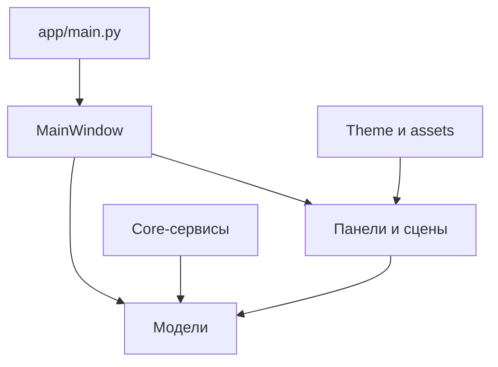
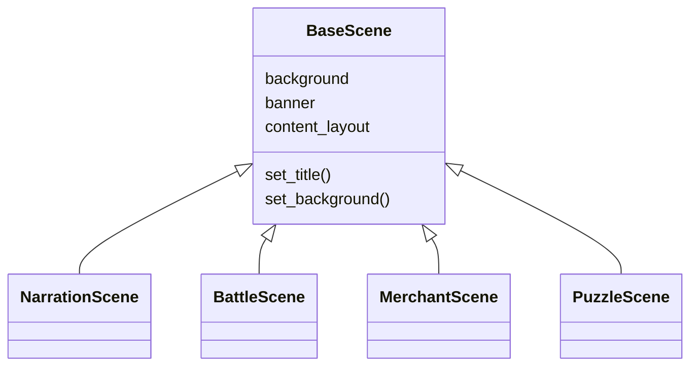
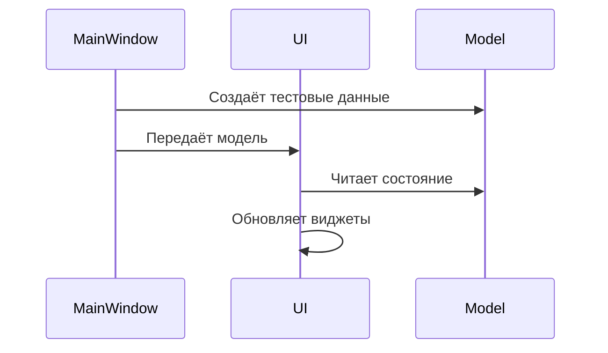
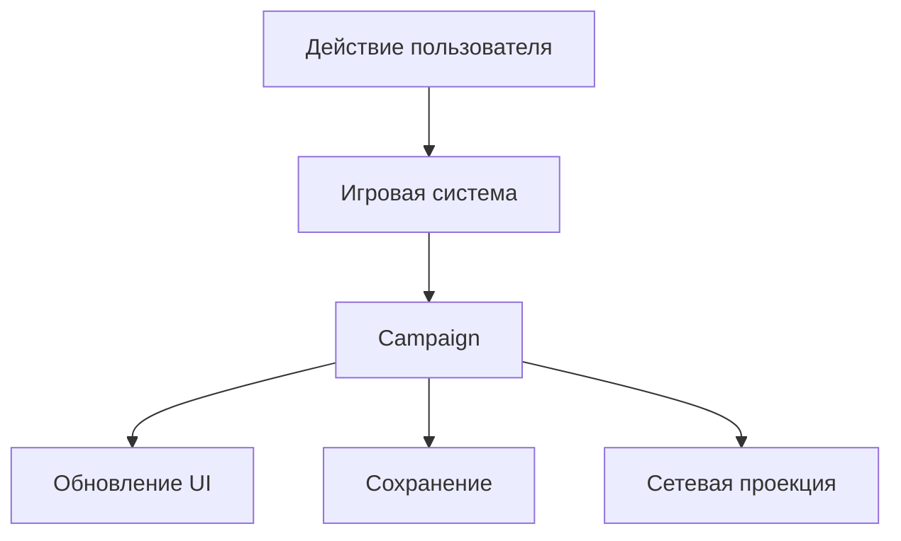
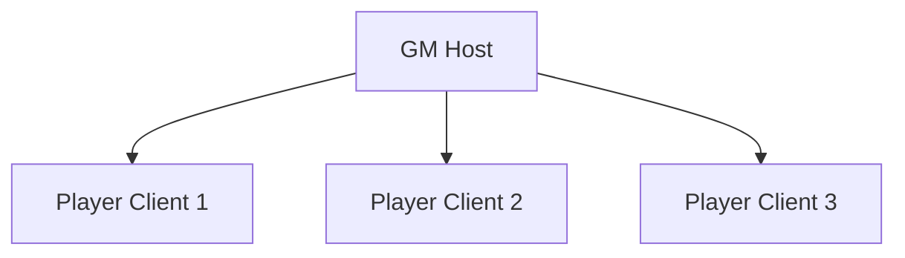

# Архитектура Campfire

> Актуальное состояние проекта и направление развития.
>
> Обновлено: 30 июля 2026 года.

---

## 1. Назначение проекта

**Campfire** — настольный цифровой игровой стол для проведения авторских RPG-сессий на Windows.

Приложение не привязано к D&D и не пытается реализовать все правила конкретной игровой системы. Его задача — дать ведущему и игрокам общий интерфейс для персонажей, сцен, противников, инвентаря, эффектов, бросков и состояния кампании.

Первая полноценная версия ориентирована на игру по локальной сети:

- ведущий запускает сессию как хост;
- игроки подключаются через локальную сеть или Radmin VPN;
- после подключения игрок выбирает подготовленного ведущим персонажа;
- ведущий хранит полное состояние кампании и управляет миром;
- клиент игрока получает только разрешённую ему часть состояния.

Campfire состоит из двух будущих приложений:

1. **Player Client** — интерфейс игрока и основа текущей разработки.
2. **GM Tool** — приложение ведущего для подготовки и проведения кампании.

Сейчас разрабатывается **Player Client**.

---

## 2. Статусы в документе

| Статус | Значение |
| --- | --- |
| ✅ Реализовано | Уже существует в рабочем коде |
| 🟡 В работе | Есть прототип или часть системы |
| ⏳ Запланировано | Архитектурное направление, код ещё не готов |
| 🧱 Зарезервировано | Папка или файл созданы, но не считаются реализованной системой |

Пустая папка или заготовка класса не означает, что соответствующая подсистема уже реализована.

---

## 3. Технологический стек

| Область | Решение |
| --- | --- |
| Язык | Python 3.11+ |
| Интерфейс | PySide6 / Qt Widgets |
| Сохранения | JSON |
| Модели | `dataclass` с `slots=True` |
| Идентификаторы | UUID, хранимые как строки |
| Сеть MVP | Локальная сеть, модель Host / Clients |
| Целевая ОС | Windows |

Для MVP не используются:

- база данных;
- облачный сервер;
- микросервисы;
- потоки и очереди задач без реальной необходимости;
- универсальная плагинная система;
- тяжёлый фреймворк состояния.

---

## 4. Архитектура на текущем этапе

Campfire сейчас является модульным настольным монолитом. Все компоненты запускаются в одном процессе, но разделены по ответственности.



Главные правила текущего этапа:

- `app/main.py` только запускает приложение;
- `MainWindow` собирает основные части интерфейса;
- панели и сцены отображают модели;
- модели не зависят от PySide6;
- тема и размеры централизованы;
- долговременное игровое состояние должно принадлежать кампании, а не виджетам;
- полноценная игровая логика будет выноситься в `systems` по мере появления действий пользователя.

Контроллеры не вводятся заранее. Пока экран только отображает данные, отдельный контроллер не нужен. Координатор или игровая система добавляется тогда, когда появляется реальный сценарий изменения состояния.

---

## 5. Текущая структура проекта

```text
Campfire/
├── app/
│   ├── main.py
│   │
│   ├── core/
│   │   ├── app_settings.py
│   │   ├── json_storage.py
│   │   ├── save_manager.py
│   │   └── event_bus.py
│   │
│   ├── models/
│   │   ├── campaign.py
│   │   ├── character.py
│   │   ├── character_stats.py
│   │   ├── character_skills.py
│   │   ├── character_feature.py
│   │   ├── creature.py
│   │   ├── health.py
│   │   ├── item.py
│   │   └── effect.py
│   │
│   ├── systems/
│   │   ├── combat/
│   │   ├── dice/
│   │   ├── inventory/
│   │   ├── quest/
│   │   └── scene/
│   │
│   ├── theme/
│   │   ├── colors.py
│   │   ├── fonts.py
│   │   ├── icons.py
│   │   ├── radius.py
│   │   ├── sizes.py
│   │   ├── spacing.py
│   │   └── stylesheet.py
│   │
│   ├── assets/
│   │   ├── icons/
│   │   ├── portraits/
│   │   └── scenes/
│   │
│   └── ui/
│       ├── main_window.py
│       ├── scene_type.py
│       │
│       ├── panels/
│       │   ├── character/
│       │   ├── inventory/
│       │   ├── combat/
│       │   ├── quests/
│       │   └── notes/
│       │
│       ├── scenes/
│       │   ├── base_scene.py
│       │   ├── battle_scene.py
│       │   ├── merchant_scene.py
│       │   ├── narration_scene.py
│       │   └── puzzle_scene.py
│       │
│       └── widgets/
│           └── cards/
│               ├── card.py
│               └── creature_card.py
│
├── docs/
│   ├── ARCHITECTURE.md
│   └── COMMIT_TEMPLATE.md
│
└── sandbox/
    ├── campaign_test.py
    └── serialization_test.py
```

Часть директорий уже создана как каркас. В частности, `systems`, некоторые `panels` и `event_bus.py` пока являются архитектурным резервом.

---

## 6. Ответственность модулей

### `app/main.py`

Точка входа приложения.

Отвечает только за:

- создание `QApplication`;
- загрузку глобальной таблицы стилей;
- создание и показ `MainWindow`;
- запуск цикла Qt.

Здесь не должно быть моделей кампании, тестовых персонажей или игровой логики.

### `app/ui`

Слой отображения и пользовательского ввода.

Содержит:

- главное окно;
- панели;
- сцены;
- диалоги;
- переиспользуемые виджеты.

UI может:

- читать переданную модель;
- отображать её состояние;
- собирать пользовательский ввод;
- отправлять действие координатору или игровой системе;
- обновляться после изменения модели.

UI не должен:

- владеть единственной копией игровых данных;
- самостоятельно сохранять файлы;
- реализовывать правила боя;
- напрямую выполнять сетевые операции;
- хранить состояние кампании внутри виджетов.

### `app/models`

Чистые модели данных, не зависящие от PySide6.

Модель отвечает за:

- структуру данных;
- безопасные значения и простые инварианты;
- сериализуемое состояние.

Модель не отвечает за:

- показ окон;
- обработку кнопок;
- сетевую синхронизацию;
- сложные сценарии использования.

Допустимый пример логики модели — нормализация здоровья и методы `take_damage()` / `heal()` у `Health`.

### `app/core`

Инфраструктурный слой приложения.

| Модуль | Ответственность | Статус |
| --- | --- | --- |
| `app_settings.py` | Локальные настройки приложения | 🟡 В работе |
| `json_storage.py` | Преобразование моделей в JSON и обратно | 🟡 В работе |
| `save_manager.py` | Чтение и запись файлов кампаний | 🟡 В работе |
| `event_bus.py` | Доставка событий внутри приложения | 🧱 Зарезервировано |

`SaveManager` определяет, где и как хранится файл. `json_storage` отвечает за преобразование данных. Эти ответственности не должны смешиваться с UI.

### `app/systems`

Будущий слой игровых сценариев.

Примеры:

- `CombatSystem`;
- `InventorySystem`;
- `DiceSystem`;
- `QuestSystem`;
- `SceneSystem`;
- `EffectSystem`.

Система получает действие, проверяет его, изменяет `Campaign` и возвращает результат. Она не создаёт виджеты и не знает о конкретных Qt-компонентах.

### `app/theme`

Единая дизайн-система.

Содержит:

- цвета;
- размеры;
- отступы;
- скругления;
- типографику;
- загрузчики иконок;
- глобальный QSS.

Новые повторяющиеся визуальные значения сначала добавляются в тему, а затем используются в UI.

`load_stylesheet()` возвращает f-строку, поэтому фигурные скобки QSS внутри неё записываются как `{{` и `}}`.

### `app/assets`

Ассеты приложения:

- иконки особенностей;
- портреты персонажей;
- маленькие портреты участников пати;
- изображения сцен;
- изображения существ и предметов.

Код должен обращаться к ассету по устойчивому имени или относительному пути. Абсолютные пути допустимы только как временный вариант для пользовательских файлов.

---

## 7. Главное окно и компоновка

Целевая компоновка клиента:

```text
┌──────────────────┬─────────────────────────────────────────────┐
│                  │                                             │
│ Панель персонажа │                Текущая сцена                │
│                  │                                             │
│                  │                              ┌──────────────┐│
│                  │                              │  Инвентарь   ││
│ Пати             │                              │  поверх сцены││
└──────────────────┴──────────────────────────────┴──────────────┘
```

### Левая область — `CharacterPanel`

✅ Реализованы:

- портрет;
- имя, раса, класс и уровень;
- компактная полоса здоровья;
- основные характеристики;
- таблица навыков;
- список особенностей с иконками и подсказками;
- компактная горизонтальная пати.

Пати состоит из маленьких портретов голов персонажей. Под каждым портретом находится миниатюрная полоса здоровья. Элементы идут слева направо, не растягиваются и рассчитаны примерно на 4–5 участников.

Список пати передаётся панели отдельно от активного персонажа. Он не хранится внутри `Character`.

### Центральная область — сцены

✅ `MainWindow` использует `QStackedWidget`.

✅ Созданы типы сцен:

- `NarrationScene`;
- `BattleScene`;
- `MerchantScene`;
- `PuzzleScene`.

✅ Общая основа вынесена в `BaseScene`:

- фоновое изображение;
- верхний баннер с названием;
- overlay-контейнер;
- область содержимого.

🟡 `BattleScene` показывает тестовые карточки существ.

⏳ Следующий шаг — заменить тестовую раскладку адаптивной сеткой и подключить карточки к состоянию кампании.

### Правая область — инвентарь

⏳ Инвентарь будет выдвижной overlay-панелью и не станет постоянно уменьшать центральную сцену.

Целевая механика:

- панель скрыта за боковой ручкой;
- вытягивается поверх сцены;
- предметы отображаются карточками;
- в свёрнутом виде видны края карточек и названия;
- наведение раскрывает карточку;
- учитывается вместимость;
- контейнеры и крафт откладываются на следующие версии.

---

## 8. Сцены и карточки

`BaseScene` определяет общий визуальный каркас, а конкретная сцена добавляет только своё содержимое.



`Card` — базовый переиспользуемый виджет карточки.

`CreatureCard` расширяет его и отображает:

- изображение существа;
- имя;
- текущее и максимальное здоровье;
- временное здоровье.

В дальнейшем от `Card` могут наследоваться карточки:

- предметов;
- NPC;
- торговых предложений;
- квестов.

Базовая карточка не должна знать правила конкретного типа сущности.

---

## 9. Модель данных

### `Campaign`

`Campaign` — корневая сущность сохраняемого игрового состояния.

Сейчас она содержит:

- `id`;
- `name`;
- список персонажей;
- заметки.

Целевая модель кампании должна дополнительно хранить:

- текущую сцену;
- участников текущей сцены;
- противников и их здоровье;
- порядок инициативы;
- активный ход;
- эффекты;
- инвентари персонажей;
- общие и личные квесты;
- состояние торговца или головоломки;
- игровые заметки;
- служебную версию формата сохранения.

Кампания — единственный источник истины для игровой сессии.

### `Character`

Персонаж хранит собственные данные:

- `id`;
- имя;
- большой портрет;
- отдельный маленький портрет для пати;
- расу;
- класс;
- уровень;
- здоровье;
- характеристики;
- навыки;
- особенности;
- предметы;
- эффекты;
- заметки.

Персонаж не хранит:

- список всей пати;
- текущую сцену;
- инициативу всего боя;
- сетевого клиента;
- Qt-виджеты.

### `CharacterStats`

Текущий набор:

- сила;
- ловкость;
- интеллект;
- харизма;
- выносливость.

### `CharacterSkills`

Текущий набор:

- внимательность;
- скрытность;
- механика;
- магия;
- медицина;
- запугивание;
- акробатика;
- атлетика;
- ловкость рук;
- убеждение;
- дрессировка;
- выживание.

### `CharacterFeature`

Описывает особенность персонажа:

- название;
- имя иконки;
- описание для подсказки.

Сохранение хранит имя ассета, а не бинарные данные изображения.

### `Health`

Хранит:

- текущее здоровье;
- максимальное здоровье;
- временное здоровье.

Инварианты:

- максимальное здоровье не меньше 1;
- текущее здоровье находится в диапазоне от 0 до максимального;
- временное здоровье не бывает отрицательным.

Одна модель `Health` переиспользуется персонажами и существами.

### `Creature`

Минимальная модель противника или другого существа сцены:

- `id`;
- имя;
- портрет;
- здоровье.

Боевые параметры будут добавляться только по мере появления реальной механики боя.

### `Item` и `Effect`

🧱 Пока являются заготовками.

Их финальные поля должны определяться через реальные сценарии инвентаря и эффектов, а не заранее.

---

## 10. Поток данных

### Сейчас

На этапе прототипа `MainWindow` создаёт тестовые модели и передаёт их виджетам.



Это допустимо для сборки интерфейса, но не является финальным способом управления сессией.

### Целевой поток



После появления интерактивных механик:

1. UI формирует действие.
2. Игровая система проверяет его.
3. Система изменяет `Campaign`.
4. UI получает обновлённое состояние.
5. При необходимости состояние сохраняется или отправляется клиентам.

`MainWindow` должен оставаться компоновщиком, а не превращаться в хранилище всех правил приложения.

---

## 11. Сохранения

Для Campfire используется JSON без базы данных.

Разделение ответственности:

- `json_storage.py` преобразует модели в словари и восстанавливает вложенные dataclass-модели;
- `save_manager.py` читает и записывает файлы;
- `Campaign` представляет сохраняемое состояние;
- UI только вызывает сценарий сохранения или загрузки.

Сериализатор должен поддерживать:

- вложенные dataclass-модели;
- списки и словари;
- UUID, хранимые как строки;
- enum-значения;
- необязательные значения;
- будущие версии схемы.

Перед фиксацией формата сохранений необходимо добавить `schema_version`. Это позволит менять модели без потери старых кампаний.

Полное сохранение должно восстанавливать игру даже:

- посреди боя;
- при незавершённом порядке инициативы;
- с изменённым здоровьем;
- с активными эффектами;
- с распределёнными предметами;
- на любой сцене.

Настройки приложения хранятся отдельно от кампании.

---

## 12. Игровые системы

Игровые системы добавляются после стабилизации соответствующих моделей.

| Система | Ответственность |
| --- | --- |
| `SceneSystem` | Переключение сцены и её состояния |
| `CombatSystem` | Урон, лечение, ход, инициатива, противники |
| `EffectSystem` | Добавление, обновление и снятие эффектов |
| `InventorySystem` | Передача, использование и ограничение предметов |
| `DiceSystem` | Броски, история и видимость результатов |
| `QuestSystem` | Общие и личные задания |

Системы не должны:

- импортировать PySide6;
- открывать окна;
- записывать JSON самостоятельно;
- обращаться к сокетам напрямую;
- хранить вторую независимую копию кампании.

---

## 13. Сетевая архитектура

⏳ Сеть добавляется после того, как локальная кампания и сохранения работают стабильно.

Используется авторитетная модель **Host / Clients**.



Правила:

- полное состояние находится у ведущего;
- только хост подтверждает изменения мира;
- игрок отправляет запрос на действие;
- хост применяет действие к кампании;
- игрок получает разрешённое обновление;
- скрытые данные ведущего не отправляются клиенту;
- при подключении игрок выбирает свободного персонажа;
- постоянная привязка пользователя к персонажу для MVP не требуется.

Первый сценарий подключения:

1. Ведущий запускает сессию.
2. Клиент вводит код или адрес сессии.
3. Хост возвращает список доступных персонажей.
4. Игрок выбирает персонажа.
5. Хост отправляет начальный снимок разрешённого состояния.
6. Дальнейшие изменения синхронизируются через действия и обновления.

Сетевой код не должен находиться внутри виджетов или игровых моделей.

---

## 14. Границы MVP

В MVP входят:

- клиент игрока;
- загрузка и выбор персонажа;
- панель персонажа и пати;
- основные сцены;
- противники и простое состояние боя;
- инвентарь;
- эффекты;
- броски кубиков;
- квесты;
- полное JSON-сохранение;
- локальное подключение игроков;
- базовый инструмент ведущего.

В MVP не входят:

- встроенный голосовой или текстовый чат;
- облачная инфраструктура;
- магазин модификаций;
- универсальный редактор правил;
- сложный крафт;
- сложная система контейнеров;
- скорость перемещения;
- линии видимости;
- шаблоны освещения;
- пассивная внимательность;
- кости хитов;
- опыт;
- автоматизация полного набора правил D&D.

Голосовое общение остаётся в Discord.

---

## 15. План развития

### Этап 1. Фундамент клиента — ✅ реализовано

- запуск приложения;
- главное окно;
- централизованная тема;
- система размеров и отступов;
- базовые модели;
- каркас сцен;
- базовая карточка.

### Этап 2. Панель персонажа — ✅ основа реализована

- портрет и идентификация;
- здоровье;
- характеристики;
- навыки;
- особенности с иконками;
- компактная пати;
- подсказки и fallback для отсутствующих ассетов.

Осталось:

- получать активного персонажа и пати из `Campaign`;
- убрать тестовые данные из `MainWindow`;
- проверить панель на разных размерах и наборах данных.

### Этап 3. Сцены и противники — 🟡 в работе

- завершить `CreatureCard`;
- перейти от тестового ряда к адаптивной сетке;
- связать `BattleScene` с данными кампании;
- подготовить состояния для остальных сцен;
- добавить нормальную загрузку фоновых ассетов.

### Этап 4. Инвентарь — ⏳ следующий крупный UI-блок

- определить минимальную модель `Item`;
- создать карточку предмета;
- создать выдвижную правую панель;
- добавить вместимость;
- связать инвентарь с персонажем и кампанией.

### Этап 5. Состояние кампании и сохранения — 🟡 прототип

- завершить собственную JSON-сериализацию;
- расширить `Campaign`;
- добавить версию схемы;
- сохранять текущую сцену и состояние боя;
- проверить полный цикл save/load;
- добавить безопасное автосохранение.

### Этап 6. Игровые сценарии — ⏳ запланировано

- урон и лечение;
- эффекты;
- инициатива;
- броски кубиков;
- квесты;
- смена сцен;
- торговец и головоломки.

### Этап 7. Запуск сессии — ⏳ запланировано

- выбор кампании;
- подключение к сессии;
- выбор персонажа;
- начальная загрузка состояния;
- восстановление незавершённой кампании.

### Этап 8. Локальная сеть — ⏳ запланировано

- авторитетный хост;
- подключение нескольких клиентов;
- фильтрация видимых данных;
- синхронизация действий;
- обработка отключения и повторного подключения.

### Этап 9. GM Tool — ⏳ после стабильного клиента

- создание кампании;
- подготовка персонажей;
- управление сценой;
- создание и изменение противников;
- управление инвентарями и эффектами;
- выдача личных заметок;
- сохранение и запуск сессии.

### Этап 10. Полировка MVP — ⏳ запланировано

- фоновая музыка сцен;
- настройки громкости;
- обработка ошибок;
- упаковка под Windows;
- тестирование полного сценария игры;
- первый стабильный playable build.

---

## 16. Архитектурные ограничения

При добавлении нового кода соблюдаются следующие правила:

1. **Не создавать абстракцию без текущего сценария использования.**
2. **Не хранить игровое состояние в виджете.**
3. **Не помещать правила игры в `MainWindow`.**
4. **Не дублировать одну сущность в нескольких независимых состояниях.**
5. **Не добавлять базу данных, пока JSON решает задачу MVP.**
6. **Не добавлять сетевой код до стабильного локального состояния.**
7. **Не смешивать сериализацию, файловую систему и UI.**
8. **Не использовать абсолютные пути как постоянные идентификаторы встроенных ассетов.**
9. **Не создавать универсальную систему правил раньше конкретной механики.**
10. **Сохранять пользовательский текст интерфейса на русском языке.**

---

## 17. Критерии готовности новой подсистемы

Подсистема считается законченной, когда:

- определена минимальная модель данных;
- ответственность не дублируется в других модулях;
- UI получает данные извне, а не создаёт собственную игровую копию;
- данные проходят полный цикл сохранения и загрузки;
- пустые значения и отсутствующие ассеты обрабатываются безопасно;
- есть простой сценарий ручной или автоматической проверки;
- код не требует незавершённой будущей системы для запуска;
- документация обновлена, если изменилась архитектура.

---

## 18. Связанные документы

| Документ | Назначение |
| --- | --- |
| `README.md` | Что такое Campfire и как запустить проект |
| `ARCHITECTURE.md` | Как проект устроен и куда развивается |
| `COMMIT_TEMPLATE.md` | Правила истории Git |
| `CURRENT_STATE.md` | Точная текущая задача и ближайшие шаги |

`CURRENT_STATE.md` стоит создать отдельно, когда проект начнёт меняться быстрее, чем общая архитектура.

